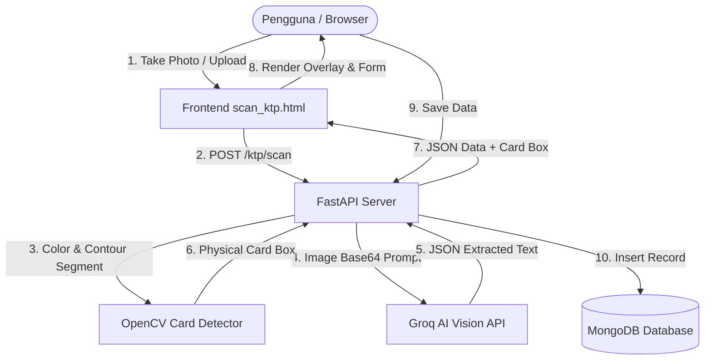

<div align="center">

# 💳 FastAPI KTP OCR & Real-time Scan System

[](https://www.python.org/)
[](https://fastapi.tiangolo.com/)
[](https://groq.com/)
[](https://opencv.org/)
[](https://www.mongodb.com/)
[](LICENSE)

_Sistem Pemindaian & Ekstraksi Data KTP-el Indonesia Berbasis AI Vision & Computer Vision dengan Bounding Box Overlays Presisi Tinggi._

</div>

---

## 📌 Deskripsi Project

Project ini adalah aplikasi web verifikasi identitas berbasis **FastAPI** dan **Groq AI Vision API**. Aplikasi ini memungkinkan pengguna untuk memindai Kartu Tanda Penduduk (KTP) Indonesia melalui kamera perangkat secara langsung maupun mengunggah file gambar.

Sistem secara otomatis:

1. Mendeteksi batas fisik kartu KTP menggunakan algoritma **OpenCV HSV Color & Contour Segmentation**.
2. Membaca dan mengosongkan teks OCR (NIK, Nama, Tempat/Tanggal Lahir, Jenis Kelamin, Alamat, RT/RW, Kel/Desa, Kecamatan, Agama, Status Perkawinan, Pekerjaan, Kewarganegaraan, dan Berlaku Hingga) menggunakan **Groq AI Vision**.
3. Menampilkan **Bounding Box Overlay visual** di atas gambar KTP yang membingkai judul dan isi setiap field secara rapi dan pas.
4. Menyimpan data hasil verifikasi ke database **MongoDB** secara asynchronous.

---

## ✨ Fitur Utama

- 📷 **Live Camera Capture & File Upload**: Dukungan pengambil foto kamera depan/belakang serta pengunggah file (`.jpg`, `.jpeg`, `.png`, `.webp`).
- 🤖 **AI-Powered OCR (Groq Vision)**: Ekstraksi teks KTP cepat dan akurat dalam hitungan detik.
- 🎯 **Computer Vision Card Detection**: Deteksi otomatis batas fisik kartu KTP berbasis OpenCV tanpa halusinasi koordinat AI.
- 🖼️ **Interactive Bounding Box Overlays**: Pemetaan kotak border visual yang pas dan fleksibel mengikuti orientasi & skala foto KTP.
- ⚡ **Asynchronous Database**: Integrasi MongoDB menggunakan `motor` untuk performa tinggi.
- 📱 **UI Responsif & Modern**: Tampilan antarmuka berdesain gelap (_dark theme_) yang ramah pengguna.

---

## 📐 Arsitektur Sistem



---

## 🛠️ Prasyarat (Prerequisites)

- **Python**: `3.9` atau versi yang lebih baru.
- **Groq API Key**: Dapatkan gratis di [Groq Console](https://console.groq.com/).
- **MongoDB**: MongoDB Atlas atau instance MongoDB lokal.
- **Web Browser**: Google Chrome, Microsoft Edge, atau Mozilla Firefox.

---

## 🚀 Panduan Instalasi (Installation Guide)

### 1. Clone Repository

```bash
git clone https://github.com/USERNAME_ANDA/REPOSITORY_ANDA.git
cd REPOSITORY_ANDA
```

### 2. Buat & Aktifkan Virtual Environment

- **Windows (PowerShell)**:
  ```powershell
  python -m venv venv
  .\venv\Scripts\Activate.ps1
  ```
- **Linux / macOS**:
  ```bash
  python3 -m venv venv
  source venv/bin/activate
  ```

### 3. Install Dependensi

```bash
pip install -r requirements.txt
```

---

## 🔑 Konfigurasi Environment (`.env`)

Buat file `.env` di root direktori project dan tambahkan kredensial berikut:

```env
APP_ENV=development
APP_PORT=8080
MONGO_URI=mongodb+srv://<USERNAME>:<PASSWORD>@cluster.mongodb.net/?retryWrites=true&w=majority
MONGO_DB_NAME=master_data
GROQ_API_KEY=gsk_your_groq_api_key_here
```

---

## 🏁 Cara Menjalankan Project (How to Run)

### Step 1: Jalankan Backend Server (FastAPI)

Buka terminal pada folder project dan jalankan perintah:

```bash
uvicorn main:app --reload --port 8080
```

- **Backend API Server**: `http://127.0.0.1:8080`
- **Swagger UI Interactive Docs**: `http://127.0.0.1:8080/docs`
- **ReDoc Documentation**: `http://127.0.0.1:8080/redoc`

### Step 2: Jalankan Frontend Interface

Buka file `scan_ktp.html` menggunakan salah satu cara berikut:

- **Via VS Code Live Server**: Klik kanan file `scan_ktp.html` > **Open with Live Server** (Akses di `http://127.0.0.1:5500/scan_ktp.html`).
- **Via Browser**: Klik 2x file `scan_ktp.html` untuk membuak langsung di browser Anda.

---

## 📁 Struktur Repository

```text
.
├── main.py              # Application Entry Point & Endpoint REST API
├── ocr_utils.py         # Logika Integrasi Groq Vision OCR & OpenCV Detection
├── models.py            # Pydantic Schema Data Models
├── database.py          # Koneksi MongoDB Async (Motor Driver)
├── scan_ktp.html        # Antarmuka Web App & Overlay Rendering System
├── requirements.txt     # Dependensi Paket Python
├── .env                 # Konfigurasi Environment Variables (Ignored in Git)
└── README.md            # Panduan & Dokumentasi Repository
```

---

## 🌐 Endpoints REST API

| Method | Endpoint           | Description                                                                   |
| :----- | :----------------- | :---------------------------------------------------------------------------- |
| `POST` | `/ktp/scan`        | Mengunggah gambar KTP dan mengembalikan hasil ekstraksi OCR & koordinat kartu |
| `POST` | `/users`           | Menyimpan data terverifikasi ke database MongoDB                              |
| `GET`  | `/users`           | Mengambil daftar seluruh data pengguna terdaftar                              |
| `GET`  | `/users/{user_id}` | Mengambil detail pengguna berdasarkan ID MongoDB                              |

---

## 📄 Lisensi

Project ini dilisensikan di bawah [MIT License](LICENSE).
